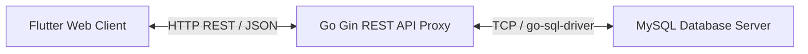

# Antigravity DBConn (MySQL Web Administrator)

A premium, modern Flutter Web client and Go Gin REST API backend proxy for connecting to, inspecting, and managing any MySQL database server.

---

## Architecture



- **Frontend (Flutter Web)**: High-performance SPA written in Dart. Features full column-level schema editing, table creation/dropping, index management with staging states, code auto-generators (SQL & OOP models), query editor with interactive grids (inserts/updates), and real-time logs.
- **Backend (Go REST API)**: Lightweight, stateless HTTP bridge built in Go using the **Gin** framework. Receives DB credentials securely in request headers (`X-DB-Host`, etc.) from the client, connects to target MySQL databases, runs the queries safely, and returns JSON payloads.

---

## Getting Started (Local Development)

### 1. Start the Go Backend Server
Run from the root directory:
```bash
# Navigate to the Go server folder
cd RESTApiServer

# Build the binary
go build -o server

# Run on default port 10001
./server

# OR run on a custom port using the -port flag
./server -port=6000
```

### 2. Start the Frontend Client
Run from the root directory in another terminal:
```bash
# Add packages and run Flutter Web inside Chrome
/Users/gimtaeyun/infraProject/SDK/flutter/bin/flutter pub get
/Users/gimtaeyun/infraProject/SDK/flutter/bin/flutter run -d chrome
```

---

## Deployment (Linux with Nginx)

To deploy the application to a Linux server:

### 1. Build the Frontend
```bash
/Users/gimtaeyun/infraProject/SDK/flutter/bin/flutter build web --release
```
This generates static files inside `build/web/`.

### 2. Copy static files to your Linux server
Copy `build/web/` contents to your Linux server's deployment path (e.g. `/var/www/dbconn/web`).

### 3. Deploy the Go Backend Proxy
Copy the compiled `server` binary (or compile it directly on the target Linux machine) to `/var/www/dbconn/RESTApiServer/`.

Setup a `systemd` service to keep it running continuously:
Create a service file `/etc/systemd/system/dbconn-backend.service`:
```ini
[Unit]
Description=Antigravity DBConn Go Backend
After=network.target

[Service]
User=www-data
WorkingDirectory=/var/www/dbconn/RESTApiServer
ExecStart=/var/www/dbconn/RESTApiServer/server -port=10001
Restart=always

[Install]
WantedBy=multi-user.target
```
Start and enable the service:
```bash
sudo systemctl daemon-reload
sudo systemctl start dbconn-backend
sudo systemctl enable dbconn-backend
```

### 4. Configure Nginx
Copy the provided `nginx.conf` file to `/etc/nginx/sites-available/dbconn` (and symlink to `sites-enabled/`) or merge it with your default configuration.
Verify and restart Nginx:
```bash
sudo nginx -t
sudo systemctl restart nginx
```

Now, navigating to your server's IP address or domain in a browser will load the DBConn client. All `/api/` traffic will be automatically routed to the Go service running on port 10001.
